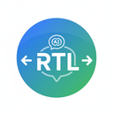

  

  # AI Chat RTL Support

  A browser extension that adds comprehensive right-to-left (RTL) text direction support to AI chat interfaces. Supports Claude.ai, ChatGPT, and NotebookLM. Perfect for users who work with RTL languages like Arabic, Hebrew, Persian, and Urdu.

## ✨ Features

### Claude.ai
- **Independent RTL Controls**: Toggle RTL separately for:
  - Chat input field
  - Main conversation content
  - Side panel
- **KaTeX Support**: Mathematical expressions automatically preserved in LTR direction
- **Configurable Panel Position**: Place the control panel at top, right, bottom, or left of the screen
- **Works Everywhere**: Functions on `/new`, `/project/*` pages and in active chats

### ChatGPT
- **Input RTL Toggle**: Control text direction for the input field on home page and in conversations
- **KaTeX Fix**: Force mathematical expressions to display correctly in RTL responses
- **Smart Detection**: Automatically detects ChatGPT conversations and applies saved settings

### NotebookLM
- **Chat Panel RTL**: Toggle RTL direction for the entire chat panel interface
- **KaTeX Fix**: Force mathematical expressions to display correctly in RTL responses
- **Notebook Detection**: Automatically detects NotebookLM notebooks and applies saved settings

### General
- **Dropdown Interface**: Platform-specific controls with automatic provider selection
- **Per-Chat Settings**: RTL preferences are saved per conversation with automatic UUID storage
- **Modern UI**: Beautiful toggle switches with smooth animations
- **Persistent Storage**: Settings are automatically saved and restored across sessions
- **Provider-Based Architecture**: Modular design allows easy addition of new AI platforms

## 🚀 Installation

### From Release

1. Download the latest release ZIP from the [Releases page](https://github.com/anatoly314/llm-gui-rtl-browser-extension/releases)
2. Extract the ZIP file
3. Open Chrome and navigate to `chrome://extensions`
4. Enable "Developer mode" in the top right
5. Click "Load unpacked" and select the extracted folder

### From Source

1. Clone the repository: `git clone https://github.com/anatoly314/llm-gui-rtl-browser-extension.git`
2. Install dependencies: `pnpm install`
3. Build the extension: `pnpm build`
4. Load the `dist` folder in Chrome as an unpacked extension

## 📖 Usage

### On Claude.ai

1. Navigate to [Claude.ai](https://claude.ai)
2. Hover over the blue trigger bar at the top/right/bottom/left of the screen
3. The control panel will slide out with the Claude.ai tab selected
4. Configure:
   - Panel position (top, right, bottom, left)
   - Chat input direction (LTR/RTL)
   - Main content direction (LTR/RTL)
   - Side panel direction (LTR/RTL)
5. Your settings are automatically saved per chat

### On ChatGPT

1. Navigate to [ChatGPT](https://chatgpt.com)
2. Hover over the blue trigger bar at the top/right/bottom/left of the screen
3. The control panel will slide out with the ChatGPT provider selected
4. Configure:
   - Input direction (LTR/RTL) - works on home page and in conversations
   - Fix KaTeX Math Expressions - force math to display correctly in RTL responses
5. Your settings are automatically saved per chat

### On NotebookLM

1. Navigate to [NotebookLM](https://notebooklm.google.com)
2. Hover over the blue trigger bar at the top/right/bottom/left of the screen
3. The control panel will slide out with the NotebookLM provider selected
4. Configure:
   - Chat panel direction (LTR/RTL) - controls the entire `<chat-panel>` element
   - Fix KaTeX Math Expressions - force math to display correctly in RTL responses
5. Your settings are automatically saved per notebook

Note: The provider dropdown shows all available platforms, but you can only select the provider matching your current platform.

## 🏗️ Architecture

### Content-Script-Only Design

This extension is a **content-script-only** extension with **NO background service worker**:

- ✅ **Zero context invalidation errors** - content scripts never lose their context
- ✅ **Simpler & more reliable** - no IPC overhead or service worker termination issues
- ✅ **Lower resource usage** - no background process running
- ✅ **Direct chrome.storage access** - content script accesses storage API directly

### Provider-Based Architecture

The extension uses a **provider-based architecture** for maximum flexibility:

- **Modular Providers**: Each AI platform (Claude, ChatGPT, NotebookLM) has its own isolated module
- **Separate Storage**: Provider-specific storage namespaces prevent data conflicts
- **Independent UI Components**: Self-contained components for each provider
- **Easy Extensibility**: Adding new AI platforms (Gemini, Perplexity, etc.) requires no changes to existing code

For detailed architecture documentation, see [CLAUDE.md](CLAUDE.md).

## 🔄 Upgrading from v0.7.x

Version 0.8.0+ includes automatic storage migration to the new provider-based architecture. Your settings will be preserved and automatically transferred to the new storage structure on first load. See [MIGRATION.md](MIGRATION.md) for details.

## 👨‍💻 Author

Created by [Anatoly Tarnavsky](https://anatoly.dev)

## 🛠️ Built With

- React + TypeScript
- Vite
- Turborepo (monorepo architecture)
- Chrome Extension Manifest V3
- Tailwind CSS
- Provider-based modular architecture
